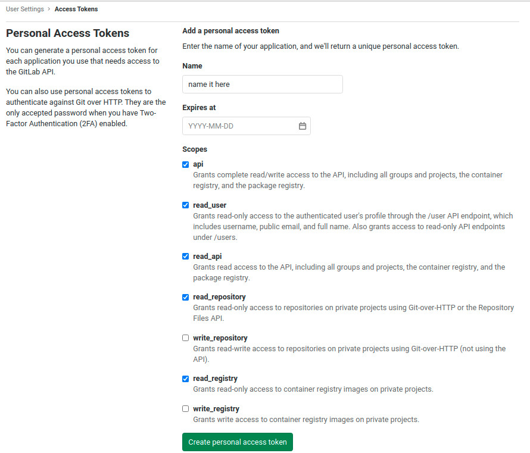
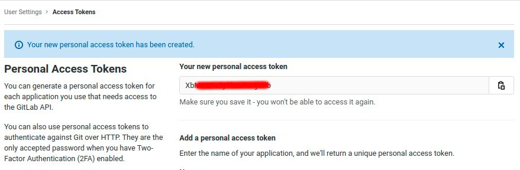

# mmd-gitlab-backuper

A command line package to backup your repositories in your local from Gitlab. Because of U.S Sanctions there is high risk without any backup. This script supports for users that run gitlab on their own servers.

### Requirements:

- node js v10 above

### Tldr:

`npx mmd-gitlab-backuper -t 'YOUR-PERSONAL-ACCESS-TOKEN'`

### How to work:

- grab a Personal Access Token from your gitlab account.

Login on your gitlab account and click on your avatar on top right. Click on `Settings` and from the left sidebar click on `Access Tokens`:

Full url for gitlab.com: [https://gitlab.com/profile/personal_access_tokens](https://gitlab.com/profile/personal_access_tokens)

Please tik the fields like in the picture

Also provide a name for this token. something like `backup-token`.



Click on `Create personal access token` and after that grab your token:



- now run command below in witch directory you want to do backup:

`npx mmd-gitlab-backuper -t 'YOUR-PERSONAL-ACCESS-TOKEN'`

wooow!! that's all. Now your repos will be available in `./repos` directory.

### Options:

See options by `npx mmd-gitlab-backuper --help`:

```
Options:
      --version  Show version number                                   [boolean]
  -t, --token    your Gitlab Personal Access Token                      [string]
  -o, --output   Backup to output directory, defaults to ./repos        [string]
  -u, --url      Specify Gitlab URL, defaults to https://gitlab.com     [string]
      --help     Show help                                             [boolean]
```

for example you can change default backup directory like this:

`npx mmd-gitlab-backuper -t 'YOUR-PERSONAL-ACCESS-TOKEN' -o './gitlab-repo'`

also if you are running gitlab on your own server you can change `url`:
`npx mmd-gitlab-backuper -t 'YOUR-PERSONAL-ACCESS-TOKEN' -u 'https://yourdomain.com'`

**NOTE**: `url` should be without `/` at the end.
